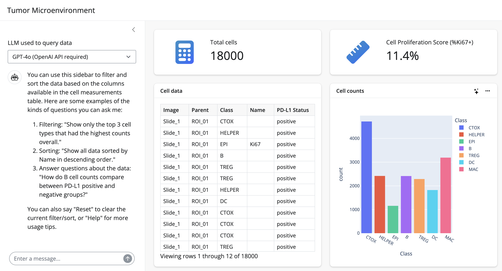

# cell-sidebot
Utilize Shiny sidebot for analyzing cell data from tissue images

Adapted from J. Cheng's [sidebot repo](https://github.com/jcheng5/py-sidebot/tree/main). 

> [!WARNING]
> Don't post sensitive data here because it's sent to an external LLM to run SQL queries. 



## Setup

Download cell-sidebot repo and install requirements
```sh
git clone https://github.com/amcrabtree/cell-sidebot.git
pip install -r cell-sidebot/requirements.txt
```

Create a .env file containing your API keys for OpenAI and/or Replicate, and fill in blanks. Note that you have to pay for any OpenAI usage, but it will update the dashboard data. Replicate is free and produces SQL code and answers questions but does not seem able to update the dashboard data at this time. 

```sh
printf 'OPENAI_API_KEY=""\nREPLICATE_API_TOKEN=""\n' > cell-sidebot/.env
```

Download jcheng's sidebot repo and copy required files:

```sh
git clone https://github.com/jcheng5/py-sidebot.git
for file in $(<cell-sidebot/copy_list.txt); do cp "$file" cell-sidebot; done
cd cell-sidebot
mkdir www
mv stars.svg styles.css www
```


## Run

```sh
shiny run --launch-browser
```

